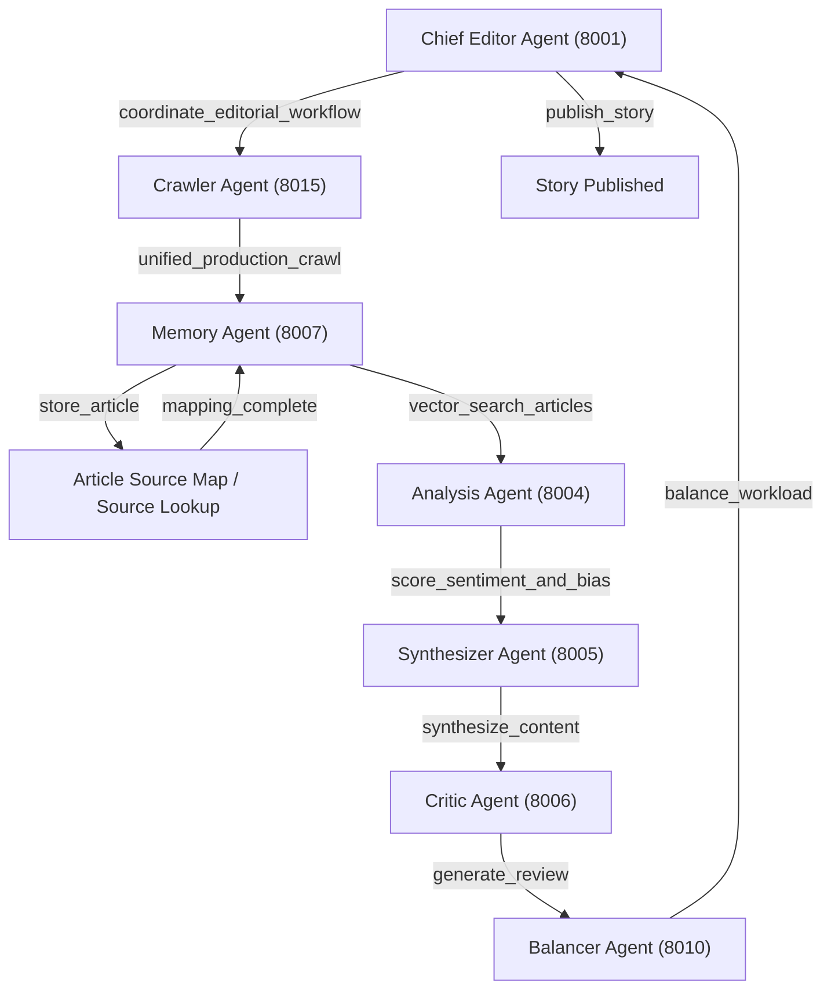
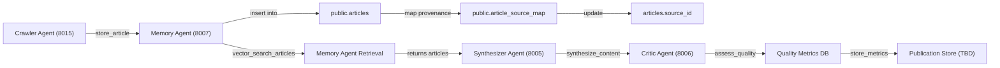

# Canonical Dataflow

This document defines the end-to-end data ingestion and processing pipeline for JustNews V4, ensuring that all articles retrieved by crawler agents flow through the MCP Bus into downstream agents (Memory, Synthesizer, Critic, Balancer, Chief Editor) with full provenance, enrichment, and orchestration.

## Agents Overview

- **Scout Agent** (Port 8002): standalone web crawling and source discovery agent exposing tools like `discover_sources`, `crawl_url`, `deep_crawl_site`, and `production_crawl_ultra_fast`.
- **Crawler Agent** (Port 8015): unified production crawling agent exposing `/unified_production_crawl`, `/get_crawler_info`, `/get_performance_metrics` via MCP Bus.
- **Memory Agent** (Port 8007): handles `store_article`, `save_article`, `vector_search_articles`, `get_recent_articles` endpoints; performs embedding, persistence, and provenance mapping.
- **Synthesizer Agent** (Port 8005): provides `cluster_articles`, `aggregate_cluster`, `synthesize_content`, and `log_feedback` for article summarization and clustering.
- **Critic Agent** (Port 8006): assesses quality of synthesized content and critiques created content destined for website publication (publication API TBD) via tools like `assess_quality`, `generate_review`, contributing feedback and metrics.
- **Balancer Agent** (Port 8002): neutralizes bias and harmonizes content via `neutralize_text` and balancing pipelines.
- **Chief Editor Agent** (Port 8001): orchestrates full workflow with `coordinate_editorial_workflow`, `request_story_brief`, `publish_story` tools.
- **Analytics Agent** (Port 8004): collects and serves performance and usage metrics (`record_performance_metric`, `get_performance_metrics`).
- **Training System**: continuous learning service for EWC-based model updates, training example ingestion (`log_training_example`), and backfill pipelines.
- **NewsReader Agent** (integrated as part of AI-Enhanced crawling): exposes `/analyze_article_with_newsreader` to extract citations, entities, and semantic structure.
- **Analysis Agent** (Port 8004): specialized quantitative analysis (`identify_entities`, `analyze_text_statistics`, `extract_key_metrics`, `analyze_content_trends`).
- **Fact Checker Agent** (Port 8003): verifies factual claims via `/verify_claim`, `/cross_reference_sources`, integrating multi-model checks.
- **GPU Orchestrator** (Port 8014): coordinates safe GPU allocation and telemetry for all GPU-accelerated agents (Analyst, Synthesizer, Balancer).

## 1. Crawl Ingestion (Scout/Crawler Agents)

1. **Source Discovery**: `scout` component or Crawler Agent calls `get_active_sources()` or `fetch_domains()` to load domains from `public.sources`.
2. **Unified Crawl**: Crawler Agent (`agents/crawler/main.py`) uses `/unified_production_crawl` tool on the MCP Bus to coordinate:
   - Ultra-fast mode (site-specific crawlers)
   - AI-enhanced mode
   - Generic multi-site mode
3. **Raw Article Extraction**: Each crawler returns a list of article payloads:
   ```json
   {"url": ..., "content": ..., "metadata": {...}}
   ```

## 2. Memory Agent Ingestion & Embedding

1. **MCP Bus Dispatch**: Crawler Agent issues an MCP Bus `/call` invoking:
   ```json
   {"agent":"memory","tool":"store_article","args":[article],"kwargs":{}}
   ```
2. **Embedding & Storage**: Memory Agent (`agents/memory/tools.py`) handles `save_article`:
   - Generates vector embedding (SentenceTransformer)
   - Inserts into `public.articles` with `content`, `metadata`, and `embedding`
   - Enqueues provenance mapping via `article_source_map`
3. **Async Queue**: Persistent storage executed in background consumer for throughput.

## 3. Provenance & Source Mapping

1. **article_source_map**: After storing, enqueue or direct insert into `public.article_source_map`:
   - Look up `sources` by `url_hash` or `domain`.
   - Insert mapping with `confidence` and `matched_by` metadata.
2. **Canonical Source Assignment**: Batch job or trigger updates `articles.source_id` using canonical selection rule.

## 4. Vector Search & Retrieval

1. **Memory Agent Query**: Upstream services call `/vector_search_articles` on Memory Agent (either via HTTP or local call) to retrieve top-k similar articles based on embeddings.
2. **Synthesizer Use**: Synthesizer Agent consumes these results in GPU-accelerated pipelines for topic clustering, summarization, and quality scoring.

## 5. Synthesis & Critique

1. **Synthesizer Agent** (`agents/synthesizer/main.py`): Tools:
   - `cluster_articles`
   - `aggregate_cluster`
   - `synthesize_content` (BART/FLAN-T5)
   - Logs performance via MCP Bus `record_performance_metric`
2. **Critic Agent** (`agents/critic/main.py`): reviews synthesized content intended for publication to the system website, providing Q/A and critique feedback (publication endpoints forthcoming).

## 6. Fact Checking & Bias Assessment

1. **Fact Checker Agent** calls during or after synthesis to verify key claims:
   - `verify_claim` tool cross-references article content against known datasets.
   - Results (`true/false/confidence`) appended to metadata.
2. **Analysis Agent** can be invoked to score sentiment and bias via `/score_sentiment`, `/score_bias` on MCP Bus.

## 7. Balancer & Chief Editor

1. **Balancer Agent** (`agents/balancer/main.py`): Harmonizes perspectives across sources, neutralizes bias.
2. **Chief Editor** (`agents/chief_editor/main.py`): Orchestrates end-to-end workflow:
   - Receives story requests
   - Calls `unified_production_crawl`, memory store, synthesizer, critic, balancer in sequence
   - Publishes final output via `publish_story` tool

## 8. GPU Orchestration

- **GPU Orchestrator** receives allocation requests from GPU-using agents via MCP Bus `/call` to `/request_lease` and `/release_lease`.
- Agents include `analyst`, `synthesizer`, and `balancer` which request and release GPU resources for heavy workloads.

## 9. Training & Continuous Learning

- **Training System** uses `log_training_example` from Synthesizer and Fact Checker outputs to build EWC-based updates.
- Periodic backfill via `backfill_article_sources.py` integrates new mapping heuristics.

## Call Order Sequence



**Sequence Explanation:**
- **Chief Editor** triggers the crawl.
- **Crawler Agent** fetches articles and passes to **Memory Agent**.
- **Memory Agent** persists, maps provenance, and provides vector search.
- **Analysis Agent** scores sentiment and bias.
- **Synthesizer Agent** clusters and synthesizes summaries.
- **Critic Agent** reviews synthesized content.
- **Balancer Agent** harmonizes and neutralizes bias.
- **Chief Editor** publishes the final story.

## Dataflow Overview


*This diagram shows the pure dataflow from crawl ingestion through storage, mapping, and retrieval queries.*

## Detailed Tool Lists

- **Scout Agent (8002)**:
  - discover_sources(args, kwargs)
  - crawl_url(args, kwargs)
  - deep_crawl_site(args, kwargs)
  - enhanced_deep_crawl_site(args, kwargs)
  - production_crawl_ultra_fast(args, kwargs)
  - get_production_crawler_info(args, kwargs)
  - production_crawl_dynamic(args, kwargs)
- **Crawler Agent (8015)**:
  - unified_production_crawl(args, kwargs)
  - get_crawler_info(args, kwargs)
  - get_performance_metrics(args, kwargs)
- **Memory Agent (8007)**:
  - save_article(content, metadata)
  - store_article(article_data)
  - vector_search_articles(query, top_k)
  - get_recent_articles(limit)
- **Synthesizer Agent (8005)**:
  - cluster_articles(articles)
  - aggregate_cluster(cluster_data)
  - synthesize_content(cluster_id)
  - log_feedback(feedback_data)
- **Critic Agent (8006)**:
  - assess_quality(content)
  - generate_review(content)
  - log_feedback(critique_data)
- **Balancer Agent (8010)**:
  - distribute_load(load_params)
  - get_agent_status()
  - balance_workload(work_params)
  - monitor_performance()
- **Analysis Agent (8004)**:
  - identify_entities(text)
  - analyze_text_statistics(text)
  - extract_key_metrics(data)
  - analyze_content_trends(corpus)
  - score_sentiment(text)
  - score_bias(text)
  - analyze_sentiment_and_bias(text)
- **Fact Checker Agent (8003)**:
  - verify_claim(claim_text)
  - cross_reference_sources(claim_text)
  - generate_fact_check_report(article)
- **NewsReader Agent (integrated)**:
  - analyze_article_with_newsreader(article)
- **GPU Orchestrator (8014)**:
  - get_gpu_snapshot()
  - request_lease(agent, resources)
  - release_lease(agent, lease_id)
  - get_policy()
  - set_policy(policy_data)
- **Analytics Agent (8004)**:
  - record_performance_metric(metric_data)
  - get_performance_metrics()
  - get_agent_profile(agent_name)
  - get_optimization_recommendations()
- **Chief Editor Agent (8001)**:
  - coordinate_editorial_workflow(request)
  - request_story_brief(params)
  - publish_story(story_data)
```
