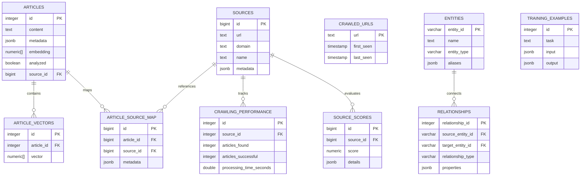

# JustNews Database Overview (Preliminary)

## Introduction
The JustNews database is a relational database designed to support the various phases of the JustNews system, including crawling, analysis, training, and reporting. This document provides a comprehensive breakdown of the database schema, the purpose of each table, and the data flow during different phases of system execution.

---

## Database Tables

### 1. `articles`
- **Purpose**: Stores the main content and metadata of articles.
- **Key Columns**:
  - `id`: Primary key.
  - `content`: The text of the article.
  - `metadata`: JSONB column for additional metadata.
  - `embedding`: Numeric array for vectorized representation.
  - `analyzed`: Boolean indicating if the article has been analyzed.
  - `source_id`: Foreign key referencing `sources`.

### 2. `article_vectors`
- **Purpose**: Stores vectorized data for articles.
- **Key Columns**:
  - `id`: Primary key.
  - `article_id`: Foreign key referencing `articles`.
  - `vector`: Numeric array for vector embeddings.

### 3. `article_source_map`
- **Purpose**: Maps articles to their sources.
- **Key Columns**:
  - `id`: Primary key.
  - `article_id`: Foreign key referencing `articles`.
  - `source_id`: Foreign key referencing `sources`.
  - `metadata`: JSONB column for additional mapping details.

### 4. `sources`
- **Purpose**: Stores information about news sources.
- **Key Columns**:
  - `id`: Primary key.
  - `url`, `domain`, `name`: Details about the source.
  - `metadata`: JSONB column for additional source details.

### 5. `crawled_urls`
- **Purpose**: Tracks URLs that have been crawled.
- **Key Columns**:
  - `url`: Primary key.
  - `first_seen`, `last_seen`: Timestamps for tracking.

### 6. `crawling_performance`
- **Purpose**: Tracks performance metrics for crawling.
- **Key Columns**:
  - `id`: Primary key.
  - `source_id`: Foreign key referencing `sources`.
  - `articles_found`, `articles_successful`: Metrics for crawling success.
  - `strategy_used`: Strategy used for crawling.

### 7. `entities`
- **Purpose**: Stores information about entities extracted from articles.
- **Key Columns**:
  - `entity_id`: Primary key.
  - `name`: Name of the entity.
  - `entity_type`: Type of entity (e.g., person, organization).
  - `aliases`: JSONB column for alternative names.

### 8. `relationships`
- **Purpose**: Tracks relationships between entities.
- **Key Columns**:
  - `relationship_id`: Primary key.
  - `source_entity_id`, `target_entity_id`: Foreign keys referencing `entities`.
  - `relationship_type`: Type of relationship.
  - `properties`: JSONB column for additional details.

### 9. `source_scores`
- **Purpose**: Tracks scores for sources.
- **Key Columns**:
  - `id`: Primary key.
  - `source_id`: Foreign key referencing `sources`.
  - `score`: Numeric score for evaluation.
  - `details`: JSONB column for additional scoring details.

### 10. `training_examples`
- **Purpose**: Stores training data for machine learning models.
- **Key Columns**:
  - `id`: Primary key.
  - `task`: Task description.
  - `input`, `output`: JSONB columns for input-output pairs.

---

## Data Flow During System Execution

### Crawling Phase
1. **Input**: URLs are added to `crawled_urls`.
2. **Processing**: Crawling performance is logged in `crawling_performance`.
3. **Output**: Articles are stored in `articles`.

### Analysis Phase
1. **Input**: Articles from `articles`.
2. **Processing**:
   - Vectorized data is stored in `article_vectors`.
   - Entities are extracted and stored in `entities`.
   - Relationships between entities are stored in `relationships`.
3. **Output**: Analysis results are updated in `articles.metadata`.

### Training Phase
1. **Input**: Training data from `training_examples`.
2. **Processing**: Models are trained using `article_vectors` and `entities`.
3. **Output**: Updated models for analysis.

### Reporting Phase
1. **Input**: Data from `source_scores` and `relationships`.
2. **Processing**: Generate reports on source reliability and entity relationships.
3. **Output**: Reports for stakeholders.

---

## Mermaid Diagram

---

## Conclusion
This document provides a detailed overview of the JustNews database and its role in supporting the system's operations. The database schema and data flow are designed to ensure efficient and scalable processing of news articles, analysis, and reporting.

---

*Document last updated: September 24, 2025*

© 2025 JustNews. All rights reserved.