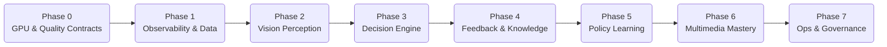

<!--
  SCOUT MULTIMODAL TRANSFORMATION IMPLEMENTATION PLAN
  Author: GitHub Copilot (assistant)
  Purpose: Provide an end-to-end execution plan for converting the Scout/crawler
           stack into a multimodal, learning-capable system.
-->

# Scout Multimodal Transformation Implementation Plan

## Executive Summary
The JustNews Scout agent currently coordinates fast, AI-enhanced crawling through a blend of Crawl4AI and NewsReader components. This document details the phased plan required to evolve that stack into a single, GPU-first, multimodal crawler that perceives, reasons, and learns from every interaction. Each phase lists concrete actions, their rationale, dependencies, and readiness checkpoints to maintain production reliability while upgrading capabilities.

---

## Table of Contents
1. [Vision and Success Criteria](#vision-and-success-criteria)
2. [Baseline Snapshot](#baseline-snapshot)
3. [Guiding Principles](#guiding-principles)
4. [Implementation Roadmap](#implementation-roadmap)
   - [Phase 0 – Foundation & Quality Contracts](#phase-0--foundation--quality-contracts)
   - [Phase 1 – Observability & Data Capture](#phase-1--observability--data-capture)
   - [Phase 2 – Vision-Led Perception Stack](#phase-2--vision-led-perception-stack)
   - [Phase 3 – Adaptive Decision Engine](#phase-3--adaptive-decision-engine)
   - [Phase 4 – Knowledge Graph & Feedback Loop](#phase-4--knowledge-graph--feedback-loop)
   - [Phase 5 – Policy Learning & Simulation](#phase-5--policy-learning--simulation)
   - [Phase 6 – Multimedia Mastery](#phase-6--multimedia-mastery)
   - [Phase 7 – Operations & Governance](#phase-7--operations--governance)
5. [Cross-Cutting Requirements](#cross-cutting-requirements)
6. [Risk Register](#risk-register)
7. [Milestone Checklist](#milestone-checklist)

---

## Vision and Success Criteria
- **Unified Scout Tooling:** One Scout interface (MCP + FastAPI) that orchestrates all crawling behaviours without site-specific code branches.
- **GPU-Enforced Fidelity:** Crawling either completes with the vision-language stack or fails fast; no quality-degrading fallbacks.
- **Async-First Pipeline:** Every Scout component exposes non-blocking asyncio interfaces and propagates async execution downstream.
- **Multimodal Comprehension:** Screenshots, DOM, text, audio, and video are processed jointly to produce canonical metadata, evidence, and contextual tags.
- **Continuous Learning:** Selector generation, action policies, and confidence calibration improve with every crawl through automated feedback loops and human-in-the-loop review.
- **Transparent Operations:** Real-time metrics, health checks, and performance reports ensure production reliability and accelerate debugging.

## Baseline Snapshot
| Area | Current Capability | Limitations | Opportunity |
|------|-------------------|-------------|-------------|
| Extraction | Crawl4AI with NewsReader/LLaVA fallback | CPU-oriented BLIP fallback dilutes quality; selectors static | Replace with GPU-only perception, dynamic selector generation |
| Orchestration | Scout calls Crawler Agent (unified production crawler) | Legacy site modules persist; partial duplication | Collapse into single policy layer with shared components |
| Learning | Performance table records basic metrics | No automated selector/policy updates | Build reinforcement & supervised loops based on captured data |
| Observability | Logs + JSON summaries per crawl | Sparse GPU health signals, no drift detection | Instrument GPU readiness, DOM drift, selector success |
| Multimedia | Images via screenshots only | No audio/video ingestion; limited gallery support | Add ASR, captioning, and media summarisation |

## Guiding Principles
1. **Quality > Coverage:** Prefer outages over degraded data to protect downstream agent accuracy.
2. **Async All the Way:** Every service boundary and crawler action must support asyncio execution patterns with bounded worker pools for blocking workloads.
3. **Incremental Delivery:** Each phase must ship a production-safe increment with clear guardrails and roll-back paths.
4. **Learning Everywhere:** Capture every decision, success, and failure as training material.
5. **MCP-Native:** All new capabilities register through Scout agent tools so other agents benefit immediately.
6. **Security & Compliance:** Maintain robots.txt adherence, content sanitisation, and audit logging while expanding automation.

---

## Implementation Roadmap
The roadmap is intentionally sequenced to strengthen production reliability before introducing advanced AI behaviours. Each phase builds on the previous while capturing reusable data for subsequent training.

### Phase 0 – Foundation & Quality Contracts
| Step | Action | Reasoning | Outputs |
|------|--------|-----------|---------|
| 0.1 | Enforce `REQUIRE_GPU=1` contract across Scout, Crawler Agent, and NewsReader. | Guarantees that any job without GPU fails immediately, preventing degraded fallbacks. | Config flag, runtime guard raising `GpuUnavailableError`. |
| 0.2 | Add GPU readiness probes to health endpoints (`/ready`). | Operators detect GPU outages before crawl requests queue. | Enhanced FastAPI health routes, dashboards/alerts. |
| 0.3 | Document incident response runbooks for GPU downtime. | Ensures rapid recovery and consistent decision-making. | Runbook entry linked from `operations/`. |
| 0.4 | Retire Playwright-based legacy modules by mapping them to GenericSiteCrawler equivalents. | Simplifies code paths before introducing new models. | Updated `UltraFastBBCCrawler`, removed unused deps. |
| 0.5 | Refactor Scout, Crawler Agent, and NewsReader entrypoints to native asyncio servers with thread/process pools for blocking segments. | Establishes an end-to-end async contract before layering new intelligence. | Event-loop compatible FastAPI lifespan hooks, shared async HTTP and queue clients. |

**Exit Criteria:** All production crawls fail fast without GPU, health probes expose GPU status, legacy Playwright code path eliminated.

### Phase 1 – Observability & Data Capture
| Step | Action | Reasoning | Outputs |
|------|--------|-----------|---------|
| 1.1 | Instrument crawl pipeline to capture DOM snapshots, screenshots, action traces, and selector outcomes per URL. | Provides the raw material required for perception training and policy learning. | Structured `crawl_sessions` dataset in object storage + metadata index. |
| 1.2 | Expand performance metrics to include selector precision, DOM drift, and modal detection rates. | Quantifies where perception struggles, guiding prioritisation. | Extended `crawling_performance` schema and dashboards. |
| 1.3 | Implement feature flags for “exploratory mode” that captures extra variability on target domains. | Collects richer training data without risking primary production runs. | Feature flag toggles, scheduler entries. |
| 1.4 | Centralise logging formats and log ingestion pipeline (e.g., Loki/ELK). | Simplifies downstream analytics and anomaly detection. | Standard JSON log schema, ingestion configuration. |
| 1.5 | Replace synchronous request queues with an async message bus (e.g., NATS JetStream or Redis Streams) to propagate crawl tasks and perception jobs. | Guarantees non-blocking flow control and backpressure handling as concurrency grows. | Message schema definitions, consumer groups with observability on lag and throughput. |

**Exit Criteria:** Every crawl produces a replayable bundle; key metrics visible in dashboards; exploratory mode capturing non-critical traffic samples.

### Phase 2 – Vision-Led Perception Stack
| Step | Action | Reasoning | Outputs |
|------|--------|-----------|---------|
| 2.1 | Deploy dedicated LLaVA-OneVision (or GPT-4o-mini equivalent) inference microservice with batching. | Enables fast, GPU-efficient screenshot reasoning shared across requests. | Containerised VLM service, load-tested throughput metrics. |
| 2.2 | Integrate LayoutLMv3/DocFormer to align DOM nodes with detected visual regions. | Provides automated selector proposals grounded in layout understanding. | `perception_service` module returning candidate selectors with confidence. |
| 2.3 | Add OCR (TrOCR) for embedded text, plus screenshot post-processing (deskew, contrast). | Handles text content not exposed via DOM. | OCR microservice, fallback pipeline. |
| 2.4 | Update GenericSiteCrawler to request perception annotations prior to extraction using awaitable calls. | Ensures AI guidance is part of the primary flow, not an afterthought, while keeping the pipeline non-blocking. | Modified crawler flow returning annotated article payloads through async generators. |
| 2.5 | Capture perception outputs into training cache with versioned model metadata. | Supports future regression analysis and retraining. | `perception_records` store referencing model versions. |

**Exit Criteria:** Crawls depend on the perception service; selectors come from AI suggestions; fallback heuristics removed.

### Phase 3 – Adaptive Decision Engine
| Step | Action | Reasoning | Outputs |
|------|--------|-----------|---------|
| 3.1 | Build a policy engine abstraction with clear actions (scroll, click, explore link, retry). | Provides a controllable interface for both rule-based and learned policies using async/await semantics. | `ActionPolicy` class with pluggable strategies exposing async `decide` and `execute` methods. |
| 3.2 | Implement contextual bandit (e.g., LinUCB) using site metadata + perception hints to choose actions. | Immediate gains without full RL, while collecting reward signals. | Policy module storing rewards in `policy_rewards` table. |
| 3.3 | Extend crawler orchestrator to support per-site policy configuration and A/B experimentation. | Enables gradual rollout and comparison against baseline. | Config-driven policy registry, A/B metrics dashboard. |
| 3.4 | Log action-level outcomes (success/failure, latency, block reason) via async sinks (Kafka, ClickHouse HTTP). | Supplies reward signals for future reinforcement learning without blocking the crawl loop. | Augmented crawl session logs with action granularity and non-blocking exporters. |

**Exit Criteria:** Crawler chooses actions through policy module; rewards tracked; ability to compare policy variants per site.

### Phase 4 – Knowledge Graph & Feedback Loop
| Step | Action | Reasoning | Outputs |
|------|--------|-----------|---------|
| 4.1 | Design `site_profile` records storing selector histories, modal patterns, paywall signatures, and content embeddings. | Establishes persistent knowledge that can be reused across crawls. | PostgreSQL + vector store schema evolution. |
| 4.2 | Implement automated drift detection comparing new perception embeddings against stored profiles. | Flags layout changes before extraction failures propagate. | Drift alerts feeding Scout notifications/Slack. |
| 4.3 | Expose human-in-the-loop review UI (could extend Chief Editor dashboard) for low-confidence results. | Transforms editorial feedback into labelled data. | UI panel, REST endpoint writing to `feedback_events`. |
| 4.4 | Build nightly training jobs to update selector generator (sequence-to-sequence) and confidence calibrator. | Converts captured experience into improved models, fed by async data loaders for replay efficiency. | Training pipelines (prefect/airflow) with model registry entries. |
| 4.5 | Wire Analyst/Critic agent signals back into policy reward shaping. | Downstream quality metrics directly influence crawler decisions. | Cross-agent feedback adapter stored in `cross_agent_feedback`. |

**Exit Criteria:** Site knowledge persists, drift triggers alerts, human & downstream feedback loop automatically adjusts selector and confidence models.

### Phase 5 – Policy Learning & Simulation
| Step | Action | Reasoning | Outputs |
|------|--------|-----------|---------|
| 5.1 | Construct a headless replay environment using captured sessions to simulate pages offline with async control loops. | Safe sandbox for training without hitting live sites while matching production concurrency semantics. | Replay service with deterministic browsers. |
| 5.2 | Train reinforcement learning agent (PPO/IMPALA) on replay environment using stored rewards. | Produces adaptive policies that generalise across sites. | Trained policy checkpoints with evaluation metrics. |
| 5.3 | Deploy RL policies in shadow mode alongside bandit policy; compare outcomes. | Ensures no regressions before full rollout. | Shadow evaluation reports, gating thresholds. |
| 5.4 | Introduce safety constraints (action filters, max retries) for RL policies. | Prevents unsafe behaviours while exploring. | Policy guardrails integrated into `ActionPolicy`. |
| 5.5 | Automate periodic retraining with new experiences and concept drift detection. | Maintains policy freshness as sites evolve. | Scheduled retraining jobs, monitoring dashboards. |

**Exit Criteria:** RL policies validated in shadow mode with improved metrics; retraining pipeline operational; guardrails enforce safety.

### Phase 6 – Multimedia Mastery
| Step | Action | Reasoning | Outputs |
|------|--------|-----------|---------|
| 6.1 | Extend perception pipeline to capture video/audio segments when encountered. | Supports modern news formats beyond text. | Media capture hooks integrated with crawler. |
| 6.2 | Add Whisper (ASR) and video summarisation (e.g., Video-LLaMA) microservices. | Generates transcripts and highlights for audio/video content. | ASR + video summary services with GPU scheduling. |
| 6.3 | Introduce image gallery extraction with captioning (BLIP-2/LLaVA) and deduplication. | Captures visual narratives that accompany articles. | Gallery processor emitting structured media metadata. |
| 6.4 | Update article schema to include multimodal evidence bundles (text, image, audio). | Ensures downstream agents receive comprehensive context. | Revised canonical metadata schema + migration script. |
| 6.5 | Add compliance filters (e.g., NSFW detection) for captured media. | Maintains ethical standards when handling user-generated imagery. | Media safety filter microservice, policy documentation. |

**Exit Criteria:** Articles include transcripts, video summaries, gallery captions; schema updated; media safety enforced.

### Phase 7 – Operations & Governance
| Step | Action | Reasoning | Outputs |
|------|--------|-----------|---------|
| 7.1 | Implement production SLA dashboard covering GPU health, policy success, drift alerts, and media pipelines. | Gives leadership a single pane of glass for system health. | Grafana/Kibana dashboards with alerting thresholds. |
| 7.2 | Define governance workflow for model updates (perception, selectors, policies). | Ensures reproducibility and audit trails for compliance. | MLOps playbook, approval checklists, model registry records. |
| 7.3 | Schedule quarterly chaos tests (GPU outage drills, perception service failover). | Validates resilience of failure modes and alerting. | Documented test results, remediation tickets. |
| 7.4 | Publish updated public/chief editor documentation and training materials. | Keeps stakeholders informed about new capabilities and interfaces. | Documentation updates, internal training sessions. |
| 7.5 | Review data retention policies for captured sessions and multimedia assets. | Aligns with privacy and storage compliance requirements. | Data retention matrix, storage lifecycle rules. |

**Exit Criteria:** Operational dashboards live, governance process enacted, resilience tested, documentation refreshed.

---

## Cross-Cutting Requirements
- **Security:** Maintain URL validation, robots.txt compliance, and strict outbound filtering across all phases.
- **Performance:** Every new service must publish throughput/latency benchmarks and support autoscaling.
- **Async Discipline:** Add linting/tests that forbid blocking I/O inside coroutine paths; instrument coroutine duration histograms to catch stragglers.
- **Cost Controls:** Track GPU-hour consumption per service; implement budget alerts when utilisation spikes.
- **Testing Strategy:** Expand `test_crawler_segmented.py` and related suites with synthetic multimodal fixtures to cover new behaviours and async race conditions.
- **Change Management:** All major upgrades gated behind feature flags with staged rollout (canary → regional → global).

## Risk Register
| ID | Risk | Phase | Mitigation | Owner |
|----|------|-------|------------|-------|
| R1 | GPU supply shortage stalls deployments | 0-7 | Maintain cold standby GPU node; negotiate reserved capacity | Infra Lead |
| R2 | Vision models misclassify sensitive imagery | 2,6 | Add human review for flagged content; integrate NSFW filters | Scout PM |
| R3 | Policy learning causes site bans | 3-5 | Respect robots/crawl delays; apply action guardrails; use replay for training | Crawler Lead |
| R4 | Storage costs explode due to session capture | 1-6 | Implement tiered storage, retention policies, compression | Data Eng |
| R5 | Cross-agent feedback loop introduces circular errors | 4-5 | Limit impact via weighting, monitor anomaly dashboards | Analyst Lead |

## Milestone Checklist
- [ ] Phase 0 complete; GPU-ready probes live; legacy modules removed
- [ ] Phase 1 datasets available; exploratory mode piloted
- [ ] Phase 2 perception stack powering production crawls
- [ ] Phase 3 policy engine selecting actions with tracked rewards
- [ ] Phase 4 knowledge graph and feedback jobs operational
- [ ] Phase 5 RL policy validated in shadow and retraining automated
- [ ] Phase 6 multimedia pipelines delivering transcripts, captions, and safe media
- [ ] Phase 7 governance, dashboards, and chaos tests approved

---

## Next Steps
1. Secure resource allocation (GPU quotas, engineering bandwidth) for Phase 0 within the next sprint.
2. Launch an async readiness audit to catalogue synchronous call sites and blocking dependencies before Phase 0 refactors.
3. Draft detailed technical designs for Phase 1 instrumentation, async messaging, and storage, including schema changes.
4. Schedule cross-team kickoff meeting (Scout, Crawler Agent, Analyst, Ops) to align on responsibilities and timelines.
5. Begin backlog grooming with tickets mapped to the roadmap steps outlined above.
