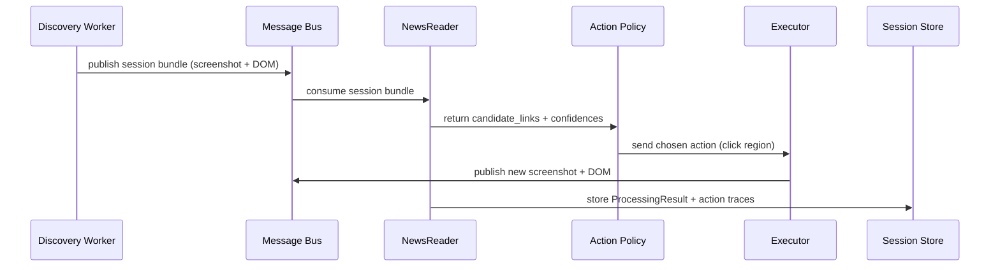

# Vision-First Practical Experiment Plan

Purpose
- Validate that NewsReader-driven, screenshot-first perception can reliably find and extract articles at scale and produce higher-quality canonical records than DOM-first heuristics.
- Run a conservative experiment (shadow + limited canonical) across representative sites and collect metrics to decide on the larger refactor.

High-level hypothesis
- A visual-first crawler using NewsReader for perception will deliver higher-quality extractions with acceptable throughput (≈50% of "ultra-fast") and therefore reduce downstream correction costs and pipeline complexity.

Success criteria (pass/fail)
- Precision: Visual-first link extractions have a higher precision (≥ +10 percentage points) vs DOM baseline across the site sample.
- Coverage: Visual-first finds at least as many valid articles (±5%) as DOM baseline on visual-heavy sites.
- Safety: No elevated site-ban signals (429/403) compared to baseline; backoff and ban detection prevents escalation.
- Cost: GPU-hours/article are within acceptable budget (< defined threshold) and the ROI favors visual-first when accounting for saved manual QC time.

Architecture (overview)

```mermaid
flowchart LR
  subgraph Discovery
    A[Discovery Worker
    (GenericSiteCrawler)]
  end
  subgraph Bus
    B[Message Bus
    (Redis / NATS JetStream)]
  end
  subgraph Perception
    C[NewsReader
    (Perception Worker)]
  end
  subgraph Policy
    D[Action Policy
    (Bandit / Rules)]
  end
  subgraph Executor
    E[Action Executor
    (Playwright)]
  end
  subgraph Storage
    F[Session Store
    & ProcessingResult DB]
  end

  A -->|screenshot + DOM| B
  B -->|consume| C
  C -->|candidate links & regions| D
  D -->|action + params| E
  E -->|new screenshot + DOM| B
  C -->|ProcessingResult| F
  E -->|action trace| F
  F -->|analytics & training| Policy
```

Experiment scope & sample
- Sites: 10 representative sites (mix: BBC, Reuters, generic local news, paywalled). Start with small domains to limit risk.
- Duration: Run 100 initial crawls per site (or 1K page attempts total) in shadow mode.
- Modes:
  - Shadow visual mode: Visual-first path runs and logs ProcessingResult; canonical DB still written by baseline DOM crawler.
  - Shadow-to-canonical (optional): For selected sites with good shadow metrics, promote visual-first to canonical ingestion in dev only.

Key components to implement
1. Feature flag: NEWSREADER_INGESTION_VISUAL (dev-only toggle)
2. Shadow call path in GenericSiteCrawler (call NewsReader) and session bundle emitter
3. Session bundle schema & storage
4. Per-domain rate limiter seeded from get_source_performance_history
5. Candidate link logging (ProcessingResult with link regions + confidence)
6. Simple Action Executor that performs safe navigation (anchors only) and returns new screenshots
7. Metrics exporters & dashboards
8. Safety: ban/backoff detector and robots.txt enforcement
9. Test harness & runner scripts

Detailed tasks (ordered)

- Task 1: Add Feature Flag & Config
  - Add NEWSREADER_INGESTION_VISUAL env flag (default false) in `deploy/systemd/env/unified-crawler.env` and dev env files.
  - Add PERCEPTION_MODE=local|central with default local for dev.
  - Add REQUIRE_GPU toggle.

- Task 2: Extend GenericSiteCrawler with Shadow-Call
  - In `agents/scout/production_crawlers/sites/generic_site_crawler.py` add an optional call after initial screenshot capture to `agents.newsreader.tools.process_article_content` or to the PerceptionClient if it exists.
  - Log returned candidate links and their bounding boxes and confidences to local staging storage (JSON lines).
  - Do not alter canonical storage when flag is on (shadow-only).

- Task 3: Session Bundle Schema & Producer
  - Define `crawl_session` JSON schema including: url, base_url, timestamp, screenshot_path, raw_dom (or cleaned snippet), candidate_selectors, candidate_regions, model_version, user_agent.
  - Implement a small publisher that writes session bundles to object storage (local path in dev) and indexes metadata in DB.

- Task 4: Per-domain Rate Limiter
  - Implement token-bucket limiter seeded from get_source_performance_history(site_id) and a conservative factor (50%).
  - Integrate into GenericSiteCrawler.rate_limiter to control visit frequency.

- Task 5: Action Executor (safe)
  - Implement safe Playwright executor that accepts actions: click(region), open(url), scroll(amount).
  - For the experiment, only use click on anchor elements discovered by NewsReader; no form submissions.

- Task 6: Collect Metrics & Exporter
  - Export metrics: extraction precision, coverage, articles/sec, GPU-hours/article, 429/403 counts, latency.
  - Add per-site dashboards (Grafana or log-based panels) and archiving of experiment logs.

- Task 7: Test Harness & Runner
  - Script `scripts/run_visual_experiment.py` to run the 10-site shadow test, with configurable concurrency and limits.
  - Integrate with `test_newsreader_segmented.py` to validate NewsReader health before experiment.

- Task 8: Safety & Ban Detection
  - Implement ban detection by monitoring response codes and anti-bot page patterns; on detection, escalate to backoff logic and notify via logs/alert.

- Task 9: Analysis & Report
  - After the experiment, compute metrics, produce a short report and recommend promotion strategy.

Data & Schema (ProcessingResult)
- ProcessingResult fields (canonical):
  - url
  - screenshot_path
  - extracted_text
  - visual_description
  - candidate_links: [{href, bbox, confidence, anchor_text}] 
  - layout_analysis
  - model_versions
  - confidence_score
  - processing_time
  - fallback_triggered (bool)
  - v2_compliance
  - agent_name, site_id, timestamp

Mermaid: Experiment flow



Experiment metrics and monitoring
- Core metrics:
  - VisualPrecision: fraction of NewsReader-suggested links that lead to valid article extractions.
  - CoverageGain: number of unique articles discovered only by visual method / baseline.
  - DownstreamQualityDelta: change in Analyst quality scores for news items extracted via visual-first.
  - SafetySignals: number of 429/403 events per site per minute.
  - GPUCostPerArticle: GPU-hours divided by successful articles.
- Logging: record per-action trace, model_version, random seed/time.
- Dashboard: show per-site VisualPrecision, CoverageGain, GPUCostPerArticle and SafetySignals.

Short timelines & estimates
- Task 1–3: 2–4 dev days.
- Task 4–6: 4–7 dev days.
- Task 7–9: 2–4 dev days + experiment runtime (varies).

PR & change checklist
- [ ] Unit tests for added code and mock GPU allocation
- [ ] Shadow-only mode enabled by default (no canonical override)
- [ ] Feature flags documentation updated
- [ ] Grafana panels/metrics created for experiment
- [ ] Ops runbook for experiment and ban/backoff rules

Safety & operational guardrails
- Robots.txt must be enforced before any visual action.
- Default to conservative per-site throughput (50% of measured safe capacity).
- Run first experiments in isolated dev/staging environments with PERCEPTION_MODE=local and REQUIRE_GPU=0 allowed (to avoid production GPU contention).
- Ensure action executor only performs non-destructive navigations during experiments.

Next immediate steps (today)
1. Implement Task 1 (feature flags) and Task 2 (GenericSiteCrawler shadow call) on `feat/scout-refactor` and run unit tests (owner: developer).
2. Start small shadow run for 3 sites in dev and iterate on logging format (owner: developer).

---

End of plan

